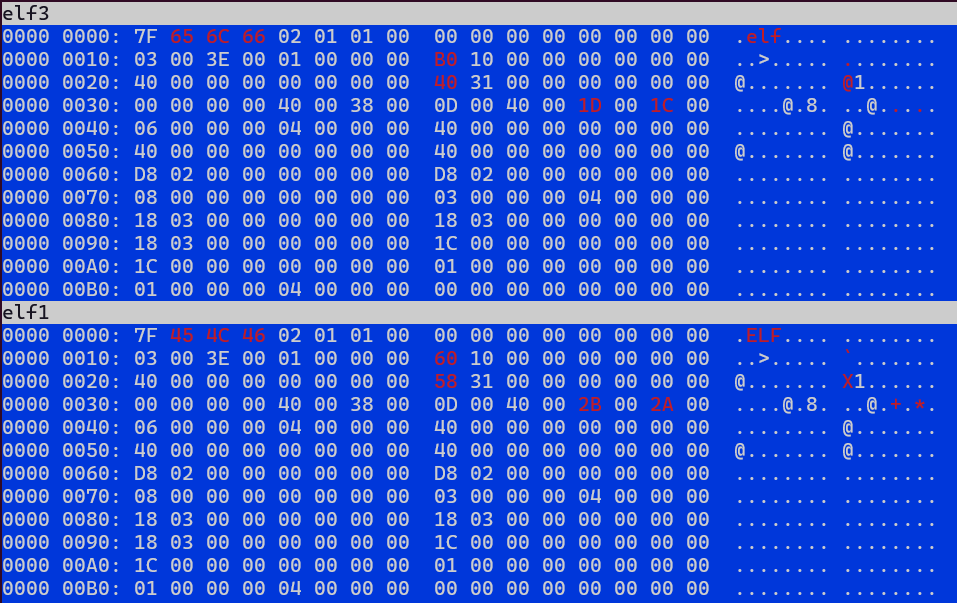
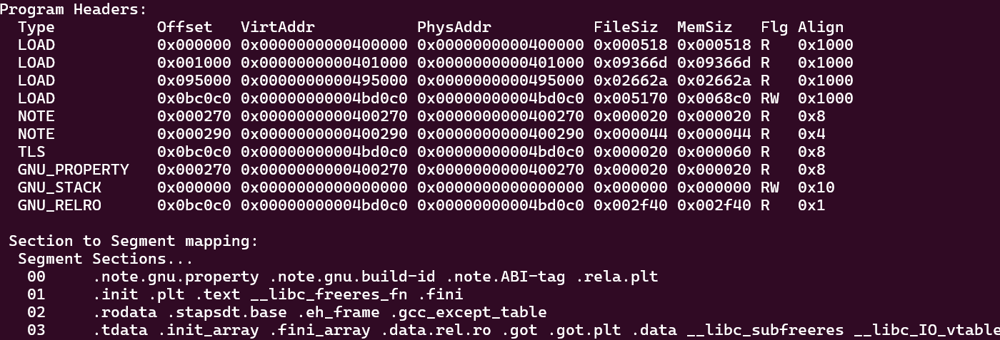
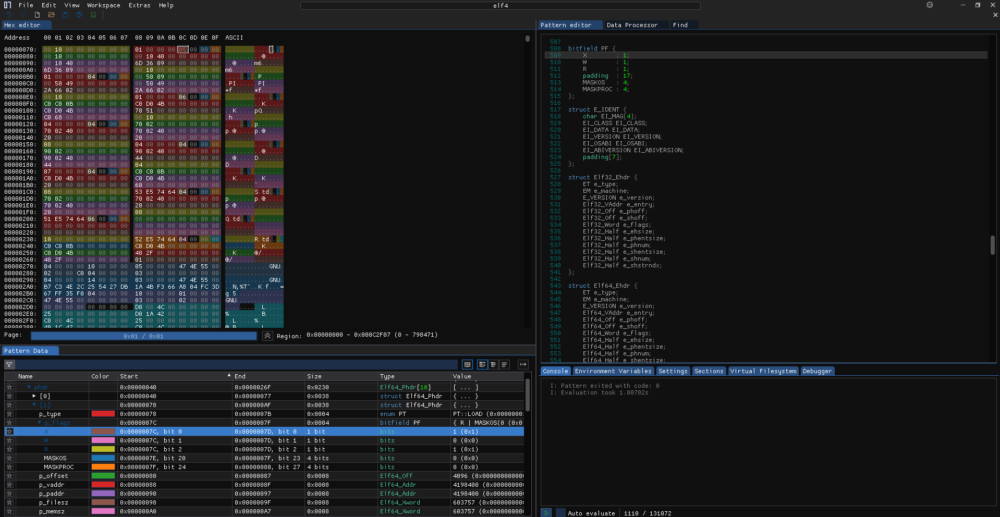

# First Assignment

I unzipped the file using `unzip ELF_files.zip`.

## elf1

1. **Running the Program**  
   - I ran `elf1`, and it showed the message `"nothing to see here"`.

2. **Basic Information**  
   - I used `file elf1` to get general information, which showed:
     - *64-bit LSB PIE executable for x86-64*
     - *Dynamically linked, with interpreter: /lib64/ld-linux-x86-64.so.2*
     - *BuildID*: `cb565ed38996d33e5c6966bbe1699175b9924c75`
     - *GNU/Linux version*: 3.2.0, *stripped* of symbols.

3. **Detailed Analysis**  
   - I ran `readelf -a -W elf1` for more information.
   - I found strange section names in the `.text` segment, specifically sections `[17]` to `[30]` with unusual labels like `B`, `A`, `S`, `{`, `s`, `3`, `c`, `T`, `i`, `0`, `N`, `5`, `}`, instead of the usual names like `.text`, `.data`, or `.bss`.

## elf2

When I attempted to run `elf2`, I encountered an error: `cannot execute binary file: Exec format error`. 
- I immediately analyzed it with `file elf2` and found that it is an executable for the 32-bit ARM architecture. The output was:
  - *ELF 32-bit LSB executable, ARM, EABI5 version 1 (SYSV), statically linked, for GNU/Linux 2.6.26, BuildID[sha1]=84f38995563fddf7e782f901ad6c84a63c7e01f9, stripped.*

To emulate running this binary, I used `qemu-arm ./elf2`, which revealed the flag: `BASC{ARMed_&_d4ng3r0uS}`.


## elf3

I ran it and encountered an error: `cannot execute binary file: Exec format error`.  
I analyzed it using the command:
```bash
file elf3
```
Output:
```
elf3: data
```

I used `readelf` to check it:
```bash
readelf -a -W elf3
```
Output:
```
readelf: Error: Not an ELF file - it has the wrong magic bytes at the start
```

I compared it with `elf1` and discovered that the magic number is wrong. In particular, `65 6C 66` corresponds to "elf" in ASCII, while `elf1` has `45 4C 46`, which corresponds to "ELF" (in ASCII, with uppercase letters).

I used the `vbindiff elf3 elf1` command:


I adjusted the magic number with the ImHex editor and then ran the ELF, discovering the flag: BASC{cAs3_maTT3rS}.


Here's a cleaned-up version:

---

## elf4

1. **Basic Information**  
   I checked the file type using:
   ```bash
   file elf4
   ```
   Output:
   ```
   elf4: ELF 64-bit LSB executable, x86-64, version 1 (SYSV), statically linked, BuildID[sha1]=b7c34e2c255427db1a4bf366a804fc3d67ff35f0, for GNU/Linux 3.2.0, stripped
   ```

2. **Execution Attempt**  
   When I tried running `elf4`, it crashed with a segmentation fault.

3. **Debugging with GDB**  
   I used GDB to investigate:
   ```bash
   gdb elf4
   (gdb) run
   Starting program: /home/marco99/BASC/elf4

   Program received signal SIGSEGV, Segmentation fault.
   0x0000000000401c60 in ?? ()
   ```
   This indicates that the program encountered a segmentation fault at memory address `0x0000000000401c60`, trying to access a restricted or invalid memory location.

4. **Checking the ELF File**  
   To analyze the issue further, I ran:
   ```bash
   readelf -l elf4
   ```
   to check the entry point address and see if it corresponded correctly to avoid any invalid memory reference. I found that the `E` (Executable) flag was missing in all sections, indicating they couldn’t execute.

   

5. **Changing Flags**  
   I opened **ImHex**, located section **01** (where `.init` and `.text` contain the entry point), and saw that its flags were set to `04` (read-only). I changed this to `05`, allowing both read and execute permissions.

   

6. **Checking the Changes**  
   After modifying the flags, I confirmed that the `E` flag was now present:
   

7. **Final Execution**  
   With the flags fixed, I ran `elf4` again and successfully obtained the flag:
   ```
   BASC{no_eXec_no_party}
   ```

## zip file
   Looking through the ELF files, I decided to check the `.zip` file using `file` to see if any ELF files were hidden inside:
   ```bash
   file ELF_files.zip
   ELF_files.zip: ELF 64-bit LSB pie executable, x86-64, version 1 (SYSV), dynamically linked, interpreter /lib64/ld-linux-x86-64.so.2, BuildID[sha1]=69e1fd0c892100efe04b1cdb0628433d7bd26038, for GNU/Linux 3.2.0, stripped
   ```

   Since it appeared as an ELF, I tried running it with `./ELF_files.zip`, but encountered a `Permission denied` error. After changing the permissions with `chmod +x ELF_files.zip`, I ran it successfully and found the flag: `BASC{can_U_run_a_ZIP?}`.

   So, this file is both an ELF executable and a ZIP archive—serving as both a directory of files and a runnable program.
