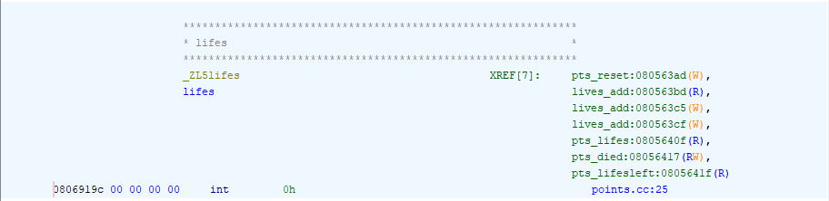
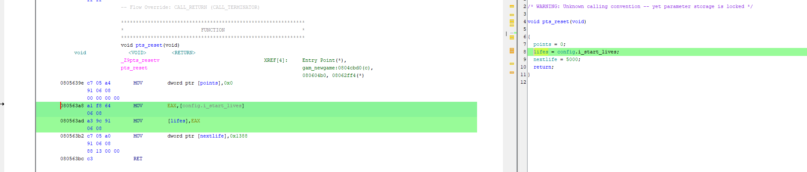
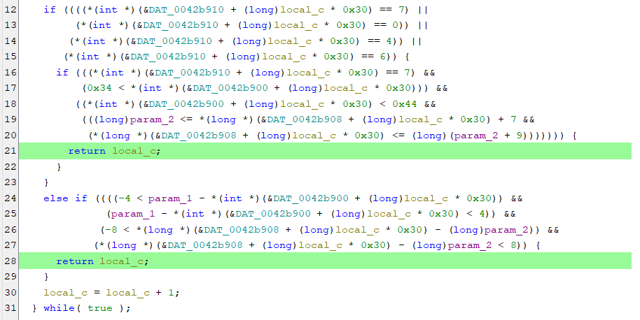

# Third Assignment

## Toppler32

### Infinite Lives Hack 

#### Main Function Navigation:
Using Ghidra tool, I started by going to the main function and followed the flow of the program. From there, I checked functions like `start_game`, `game_init` and `meminit`, but I didn’t find anything related to life management. Instead, I found functions responsible for initializing game memory before it starts.
I then explored `mem_main`. After further investigation, I discovered `mem_main_start_game_proc`, where I traced the flow to the main game loop.

#### Main Game Loop:
Inside the main game loop (`main_game_loop`), I observed the code checking whether the player’s lives were left (`pts_lifesleft`). This function was key in determining whether the game continued or not, as it returned a value that influenced the game’s flow.

#### Identifying Life Decrement:
Inside the main game loop, I noticed that the game checks the result of `gam_towergame` and, if the result was `GAME_DIED`, it called `pts_lifesleft`. This pointed me to the `pts_died` function, which is responsible for decrementing lives.

```c
void pts_died(void)
{
  lifes = lifes - 1;
  return;
}
```

#### Assembly Code Before Modification:
```assembly
08056417 83  2d  9c       SUB        dword ptr [lifes ],0x1   ; Decrement lives by 1
0805641e c3              RET
```

#### Assembly Code After Modification (NOP added to prevent life decrement):
```assembly
08056417 90    NOP NOP NOP NOP NOP NOP NOP        ; No operation, prevents the decrement
0805641e c3              RET
```

#### Result:
By adding a `NOP` (No Operation) at the start of the code that decrements lives, the lives are no longer decreased, effectively giving the player infinite lives.


#### Alternative Approaches:

1. **Decrement by 0:**  
   Instead of adding a `NOP` instruction, we could modify the `pts_died` function to decrement `lifes` by 0. This would have the same effect of preventing the decrease in lives.

   ```c
   void pts_died(void)
   {
     lifes = lifes - 0;  // No change to the number of lives
     return;
   }
   ```

2. **Modify `pts_lifesleft`:**  
   Another way to achieve infinite lives without directly modifying `pts_died` is to make the `pts_lifesleft` function always return `1`. This would cause the game to always believe that the player has lives left, preventing it from calling the `pts_died` function.

   ```c
   bool pts_lifesleft(void)
   {
     return 1;  // Always return 1, preventing the game from ending
   }
   ```


### More Lives Hack
Using Ghidra, when I click on the variable `life` in functions like `main_game_loop` or `pts_lifeleft`, the tool allows me to see where the variable is used throughout the program. Through this investigation, I discovered the following:



The variable is used in five functions. In particular, I examined the first function, `pts_reset`, and discovered that the initial number of lives is stored in `config.i_start_lives`.



Upon further investigation in `config`, I found that this variable is only referenced in the `game_option_menu_lives` function, which allow the user to edit the number of lives at the start of the game at maximum of 3 lives:

```c
      config.i_start_lives = config.i_start_lives + 1;
      config.need_save = true;
      if (3 < config.i_start_lives) {
        config.i_start_lives = 3;
      }
```

In assembly, this corresponds to the following:

```assembly

        08053c9f 83 f8 03        CMP        EAX,0x3  <-- compare the EAX value if is equal with 3
        08053ca2 7e 24           JLE        LAB_08053cc8  <-- jump if less or equal
        08053ca4 c7 05 f8        MOV        dword ptr [config.i_start_lives],0x3
                 64 06 08 
                 03 00 00 00
```

To increase the starting lives, I simply modified `0x3` to a different number, such as 100 lives:

```assembly
        08053c9f 83 f8 64        CMP        EAX,0x64  <-- value updated
        08053ca2 7e 24           JLE        LAB_08053cc8  
        08053ca4 c7 05 f8        MOV        dword ptr [config.i_start_lives],0x64 <-- value updated
                 64 06 08 
                 64 00 00 00
``` 
This modification sets a higher maximum number of starting lives, which can be configured in the game's menu options.


### Time Freeze Hack

#### Main Function Navigation:  
While looking at `gam_towergame`, I started by analyzing the `akt_time` function, which is responsible for updating the game timer. By following the flow of this function, I discovered that it checks if the `timecount` variable has reached 5. If it has, the code decreases the `time` variable by 1.

#### Identifying Timer Decrement:  
Inside the `akt_time` function, I found the part of the code where the game logic checks if `timecount` has reached 5. If it has, it decreases the `time` variable by 1. This was the key section to modify in order to change the timer behavior.

```c
if ((-1 < *timecount) && (iVar1 = *timecount + 1, *timecount = iVar1, iVar1 == 5)) {
    *timecount = 0;
    uVar2 = *time - 1;   // Decrement time by 1
    *time = uVar2;
}
```

#### Assembly Code Before Modification:  
The assembly code responsible for decrementing the timer was:

```assembly
0804c4f1 83 e8 01   SUB        time, 0x1  ; Decrement timer by 1
0804c4f4 89 03       MOV        [EBX], time
```

#### Assembly Code After Modification (Subtracting Zero):  
To stop the timer from decreasing, I modified the code to subtract 0 instead of 1. This way, the `time` value remains unchanged.

```assembly
0804c4f1 83 e8 00   SUB        time, 0x0  ; No change, time remains the same
0804c4f4 89 03       MOV        [EBX], time
```

#### Result:  
By changing the code to subtract 0, the timer is now "frozen" and no longer decreases. This prevents the game from advancing based on time, allowing the player to have unlimited time without the game running out of time.


### No Robots Hack

#### Navigation:

I started by analyzing the game code with Ghidra, focusing on functions like **`top_testcollision`** and **`rob_topplercolision`** to understand collision management. I found that **`top_testcollision`** checks collisions between game objects, while **`rob_topplercolision`** specifically handles collisions between robots and the player or projectiles.

While exploring, I noticed an array called `object` that holds information about the various robots. By tracing how and where this array is modified, I discovered the **`rob_new`** function, which handles the logic for spawning robots. I realized that this function controls robot creation based on certain conditions and updates the properties of objects in the `object` array.
#### Identifying the Spawn Condition:

  ```c
  iVar6 = 0;
  while( true ) {
    if (3 < iVar6) {
      return;
    }
    ...
  ```
Within the code, I found that the game used a comparison to check if the value of `ESI` (used as `iVar6` in the source code) was greater than `3`. This comparison determined whether the spawn process would proceed.

```assembly
08056a64  BE  00 00 00 00    MOV    ESI, 0x0     ; Set ESI (iVar6) to 0 (beginning of the loop)
08056a69  83 FE 03           CMP    ESI, 0x3     ; Compare ESI (iVar6) with 3
08056a6c  7F 46               JG     LAB_08056ab4  ; If ESI > 3, jump to LAB_08056ab4 (skip spawn)
```

#### Assembly Code Before Modification:
The code compares `ESI` with `3` and, if `ESI` is greater than `3`, it jumps to a different part of the program, skipping the spawning logic.

```assembly
08056a69  83 FE 03           CMP    ESI, 0x3     ; Compare ESI (iVar6) with 3
08056a6c  7F 46               JG     LAB_08056ab4  ; Jump if greater than 3 (skip spawn)
```

#### Assembly Code After Modification:
To prevent the spawning, I modified the conditional jump (`JG`) to an unconditional jump (`JMP`). This ensures that the program will always skip the spawning logic, no matter the value of `ESI`.

```assembly
08056a69  83 FE 03           CMP    ESI, 0x3     ; Compare ESI (iVar6) with 3
08056a6c  EB 46               JMP    LAB_08056ab4  ; Jump unconditionally to LAB_08056ab4 (skip spawn)
```


### **More Time Hack**

I found this function in the `game_towergame` source code:

```c
Uint16 lev_towertime(void)
{
  return towertime;
}
```

I was curious whether modifying the return value would also change the initial timer value, so I decided to modify the corresponding assembly code.

### **Original Assembly Code:**

```assembly
0804f0eb 0f  b7  05       MOVZX      EAX, word ptr [towertime]
0804f0f2 c3              RET
```

In this code, the `lev_towertime` function loads the `towertime` value from memory and returns it. The `MOVZX` instruction loads the `towertime` value (a `Uint16`) into the `EAX` register and extends it.

### **Modification Made:**

I modified the assembly code as follows to simulate the time hack:

```assembly
b8 ff ff ff ff    MOV EAX, 0xFFFFFFFF
90 90            NOP (No Operation)
```

This instruction loads the value `0xFFFFFFFF` into the `EAX` register. This value will replace the actual `towertime` value when the function is called, so every time the function is invoked, it will return `0xFFFFFFFF` instead of the actual `towertime`.

The `NOP` (No Operation) instructions are used to maintain the original byte alignment and ensure no code gets broken by the modification.

I tested it, and the timer is now set to a very high value, as expected, instead of the original value before the modification.


## Toppler64

### No decrementing lives Hack

I followed the first hint's address and immediately found different functions for managing lives. I focused particularly on when `FUN_00413ffb` is called. Using GDB, I set a breakpoint at the address and discovered it is called when the player dies. To prevent lives from decreasing, I modified the subtraction operation from:

```c
void FUN_00413ffb(void)
{
  DAT_0042b8f0 = DAT_0042b8f0 + -1;
  return;
}
```
```assembly
        00414005 83  e8  01       SUB        EAX ,0x1
        00414008 89  05  e2       MOV        dword ptr [DAT_0042b8f0 ],EAX
                 78  01  00
```
to:
```c
void FUN_00413ffb(void)
{
  DAT_0042b8f0 = DAT_0042b8f0 - 0;
  return;
}
```

```assembly
        00414005 83  e8  01       SUB        EAX ,0x0
        00414008 89  05  e2       MOV        dword ptr [DAT_0042b8f0 ],EAX
                 78  01  00
```
so that the lives do not decrease.


### Time Freeze Hack

I followed the suggested hint and repeated the cheat I implemented in the 32-bit version for the 64-bit version as follows:

---

#### Original Code in C:
```c
if ((-1 < *param_2) && (*param_2 = *param_2 + 1, *param_2 == 5)) {
    *param_2 = 0;
    *param_1 = *param_1 - 1;
    ...
```

#### Modified Code in C:
```c
if ((-1 < *param_2) && (*param_2 = *param_2 + 1, *param_2 == 5)) {
    *param_2 = 0;
    *param_1 = *param_1 - 0;
    ...
```

In this modification, `*param_1` represents the time variable. By subtracting `0` instead of `1`, the time no longer decreases.

---

#### Assembly Code Before Modification:
The assembly code responsible for decrementing the timer was:

```assembly
        004063fc 8b 00           MOV        EAX, dword ptr [RAX]
        004063fe 8d 50 ff        LEA        EDX, [RAX + -0x1]
        00406405 89 10           MOV        dword ptr [RAX], EDX
```

#### Assembly Code After Modification (Subtracting Zero):
```assembly
        004063fc 8b 00           MOV        EAX, dword ptr [RAX]
        004063fe 8d 50 00        LEA        EDX, [RAX + 0x0]     # 0x0 instead of -0x1
        00406405 89 10           MOV        dword ptr [RAX], EDX
```

By replacing `-0x1` with `0x0`, the subtraction operation effectively becomes a no-op, freezing the timer.


### Infinite Lives Hack

#### Code Exploration and Function Analysis:
Using Ghidra, I found the part of the game code responsible for setting the number of starting lives. This is in the function `FUN_00403e06`, located at the hinted address `0x403e06` . The function handles game settings, including the starting lives, by reading the `.toppler.rc` configuration file.

By default, the game limits the maximum starting lives to 3. This is controlled by the following code:

```c
else if (3 < *(int *)(param_1 + 8)) {
    *(undefined4 *)(param_1 + 8) = 3;
}
```

#### Assembly Code Before Modification:
The corresponding assembly code looked like this:

```assembly
00404288 83 f8 03           CMP        EAX, 0x3    ; Check if lives > 3
00404291 c7 40 08 03 00 00 00 MOV        dword ptr [RAX + 0x8], 0x3 ; Set lives to 3
```

#### Modification:
To allow for more starting lives, I changed the value `0x3` to `0xff` (255). This way, the new maximum lives became 255, as higher values caused the game to crash.

#### Assembly Code After Modification:
The updated assembly code is:

```assembly
00404288 83 f8 ff           CMP        EAX, 0xff   ; Check if lives > 255
00404291 c7 40 08 ff 00 00 00 MOV        dword ptr [RAX + 0x8], 0xff ; Set lives to 255
```

#### Testing:
To test this change, I updated the `.toppler.rc` file to set a new starting lives value:

```plaintext
~/.toppler.rc
nobonus: no
game_speed: 0
start_lives: 30
password: ""
...
```


### No collision Hack

I followed the suggested hint using ghidra i navigate to the address 0x414a44 and i found the FUN_00414a44 function
i debbugged it with gdb (first to the 0x414a44 address) and i discover that i called always, so i debbugged in certain conditions like the jumps to the return

```assembly
        00414c30 eb  0f           JMP        LAB_00414c41
```
```assembly
        00414b70 e9  cc  00       JMP        LAB_00414c41
                 00  00
```



and i discover through the debugger  it stops (it returns) in that conditions when there are collision with the robot in the game, so i setted local_c higher than 3 in order to return before the conditions 
```c
  local_c = 0;
  do {
    if (3 < local_c) {
      return -1;
    }
    ...
```
```assembly
        00414a4e c7  45  fc       MOV        dword ptr [RBP  + local_c ],0x0
                 00  00  00  00
```

to 
```assembly
        00414a4e c7  45  fc       MOV        dword ptr [RBP  + local_c ],0x4
                 00  00  00  00
```
so it dosent allow collossion with robot