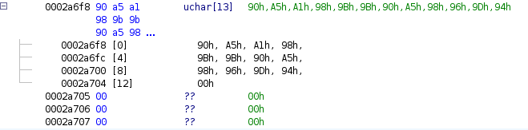
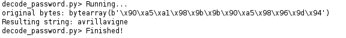
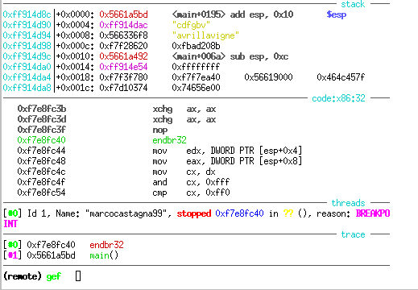
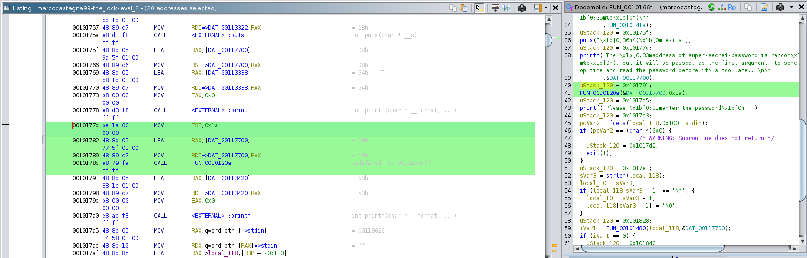
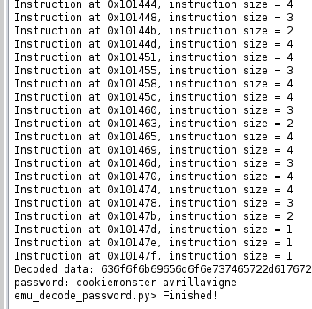

# Sixth Assignment

## The Lock Level 1

I started reversing the binary with Ghidra and checked the addresses of each function. I obsever the execution, starting analyzing the `decode` function (first leak), I noticed that it takes a buffer as input and modifies each byte by adding `0xd1` to it.

```c
void decode(uchar *buf, int size)
{
  int a;

  for (a = 0; a < size; a = a + 1) {
    *buf = *buf + 0xd1;
    buf = buf + 1;
  }
  return;
}
```

So, the program simply decodes the original password, compares the user input with the encoded password, and if they match, call print_flag:

```c
  iVar3 = strcmp(acStack_115 + 1, (char *)my_super_password);
  if (iVar3 == 0) {
    printf("\x1b[0;33m\nWow! You got it, congratulations.\n\x1b[0m");
    print_flag(acStack_115 + 1, local_14);
```

So I observed the `print_flag` function (second leak). It takes the user input, calculates a Blake2b hash, and then uses XOR to combine the default flag (an array in the code) with the hash of the input to create the final "flag":

```c
  crypto_blake2b(hash, (u8 *)input, input_len);
  for (a = 0; (uint)a < 0x40; a = a + 1) {
    flag[a] = flag[a] ^ hash[a & 0x3f];
  }
  puts("Here is your flag: \x1b[0;32m");
  puts((char *)flag);
  puts("\x1b[0m");
  return;
}
```

At the end, it clears the encoded password by calling the `clear` function (as the third leak), which sets all bytes to 0 using `memset`.

```c
void clear(uchar *buf,int size)
{
  memset(buf,0,size);
  return;
}
```

I also noticed the last leak, which refers to the memory location of the password:



The memory contains 12 bytes that don't correspond to anything in ASCII.

To solve the challenge, I decided to decode these bytes using the same logic as the `decode` function. I wrote a Python script in Ghidra that reads the bytes, adds `0xd1` to each one. I passes as argument the address of the presumed password I found earlier.

```python
def modify_bytes_and_read_c_string(addr, size):
    modified_result = bytearray()
    
    for _ in range(size):
        if monitor().isCancelled():
            return None
        byte = getByte(addr) & 0xff
        if byte == 0:
            break
        
        # Add 0xd1 to the byte and ensure the result is always a byte (modulo 0xFF)
        modified_byte = (byte + 0xd1) & 0xff
        
        # Append the modified byte to the result
        modified_result.append(modified_byte)
        
        addr = addr.next()

    return modified_result

# Starting address and the size of bytes (12)
addr = toAddr(0x0002a6f8)
size = 12

# Read and modify the bytes
modified_bytes = modify_bytes_and_read_c_string(addr, size)

# Print the original bytes and the output string
original_bytes = read_c_string(addr)
print(f"original bytes: {original_bytes}")
print(f"Resulting string: {modified_bytes.decode('utf-8')}")
```

Running my script produced the following:



I ran the binary and entered the password I obtained, which gave me the flag:

```bash
BASC{Y0u_int3rc3pt3d_stRcMp_didnt_U---marcocastagna99-cDGNHOpR}
```

Alternatively, the simplest way to discover the password (following the programme's suggestions) is to debug the program by setting a breakpoint on `strcmp` and observing the stack during the function call. This will clearly show the password passed to the function. Because once the password is decoded at the beginning, it is passed to the `strcmp` and `clear` functions, so setting breakpoints at these points allows you to halt execution and inspect what is being passed.



## The Lock Level 2
This time, the executable is 64-bit and, most importantly, it is stripped, meaning the strings are removed, which makes debugging more difficult compared to before. When looking at the disassembled code in Ghidra, I realize the code is the same as before, but without the function names.

First, I go to look at the decoding function and notice it’s much more complex:

```c
void FUN_0010120a(char *param_1)
{
  param_1[0x15] = param_1[0x15] + -0x31;
  param_1[8] = param_1[8] + ']';
  param_1[0x12] = param_1[0x12] ^ 0x7e;
  param_1[0xb] = param_1[0xb] + ':';
  param_1[0x14] = param_1[0x14] ^ 0x7d;
  param_1[7] = param_1[7] + '/';
  param_1[0x11] = param_1[0x11] ^ 0x44;
  param_1[0x18] = param_1[0x18] + '6';
  param_1[0xe] = param_1[0xe] + '\x14';
  param_1[1] = param_1[1] + -4;
  param_1[0x17] = param_1[0x17] + -0x11;
  param_1[0x13] = param_1[0x13] + 'O';
  param_1[0x10] = param_1[0x10] + '\\';
  param_1[0x16] = param_1[0x16] ^ 0x3b;
  param_1[4] = param_1[4] + -0x29;
  param_1[3] = param_1[3] + -0x12;
  param_1[0xd] = param_1[0xd] + 'L';
  *param_1 = *param_1 + -0x75;
  param_1[5] = param_1[5] + -0x5a;
  param_1[0xc] = param_1[0xc] + '$';
  param_1[0xf] = param_1[0xf] + '-';
  param_1[2] = param_1[2] ^ 0x4e;
  param_1[0x19] = param_1[0x19] ^ 0x2d;
  param_1[6] = param_1[6] + '/';
  param_1[9] = param_1[9] + '\x1f';
  param_1[10] = param_1[10] + -0x49;
  return;
}
```

This makes the challenge more difficult.

### SOLUTION
An effective solution without needing to decode directly the string is to emulate the code in a specific range and see how the memory changes before and after the function call.

I chose to use Unicorn to emulate the executable in Ghidra. First, I mapped the code section using the starting address of .text and its offset (founded in ghidra memory map), and I set the stack size.

```python
CODE_ADDR = 0x001010B0  # Address of the .text
CODE_SIZE = 0x11823     # Size of the .text
STACK_ADDR = 0x200000
STACK_SIZE = 1024 * 1024
```

Since the address and offset are not multiples of 4k, making mapping difficult, I aligned the addresses like this:

```python
start_addr = CODE_ADDR & ~0xFFF
# Calculate end address (aligned upwards)
end_addr = (CODE_ADDR + CODE_SIZE + 0xFFF) & ~0xFFF
# Total size of memory to map
PG_CODE_SIZE = end_addr - start_addr
```

Then, I mapped the memory with the correct permissions and set up the stack pointer (RSP):

```python
# Map the memory from start_addr to end_addr
emu.mem_map(start_addr, PG_CODE_SIZE, UC_PROT_READ | UC_PROT_WRITE | UC_PROT_EXEC)

# Code data to be emulated
all_bytes = bytes(b & 0xff for b in getBytes(toAddr(CODE_ADDR), CODE_SIZE))
emu.mem_write(CODE_ADDR, all_bytes)  # Write the code to memory

# Map the stack
emu.mem_map(STACK_ADDR, STACK_SIZE, UC_PROT_READ | UC_PROT_WRITE)
emu.reg_write(UC_X86_REG_RSP, STACK_ADDR + STACK_SIZE - 8)  # Set the stack pointer
```

So first, I mapped the space, then wrote the bytes, and then allocated the stack.

I did the same thing with the .data section to allow the emulation to modify data in memory and read the password from the mapped emulator memory.

```python
DATA_ADDR = 0x117040  # Address of the .data
DATA_SIZE = 0x6e8     # Size of the .data

aligned_data_addr = DATA_ADDR & ~0xFFF   # Align the address to the page size
dat_size_aligned = (DATA_SIZE + 0xFFF) & ~0xFFF  # Align the size to the page size

emu.mem_map(aligned_data_addr, dat_size_aligned, UC_PROT_READ | UC_PROT_WRITE)
all_bytes_data = bytes(b & 0xff for b in getBytes(toAddr(DATA_ADDR), DATA_SIZE))
emu.mem_write(DATA_ADDR, all_bytes_data)
```

**The address alignments and correct permissions are crucial.**

Once I defined and added the hook_code function to monitor the execution, I run the emulation on this range:

```python
emu.emu_start(0x0010177d, 0x00101791)
```

This corresponds to the code responsible for calling the decode function:



I can then emulate and read the string stored in DAT00117700:

```python
emu_dec_data1 = emu.mem_read(0x117700, 0x1a).decode('latin1')
print("password:", emu_dec_data1)
```

And this is the result:



With the password `cookiemonster-avrillavigne`, I unlocked the lock and obtained the final flag 🥹

```bash
BASC{Br3akP0int5_and_3mul4t10n_R_us3fUl---marcocastagna99-hlfxNeGr}
```